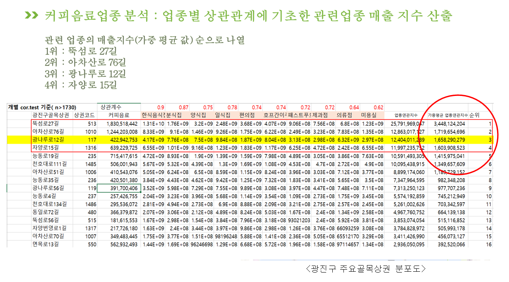

<h1 align="center">업종별 매출연관성에 기초한 골목상권 창업 입지 추천 </h1>

빅데이터 분석 프로젝트 by 빅데이터 온 더 플랜

## 0. 프로젝트 시작 :  매장 입지를 선정할 때에는, 같은 상권의 다른 업종을 분석하라!

- 서울시 골목상권 공공데이터를 이용하여, 성별 및 연령별 유동인구/배후지 거주자 특징/배후지 직장인/주변 시설물(학교, 공공기관 등) 등과 매출 상관관계를 분석 실행
- 업종별로 분석결과 골목상권의 매출과 유의미한 상관관계가 발생한 골목상권 배후지의 특성이 없음(상관관계 0.2 이하) 
- 반면에, 골목상권 내의 업종별(커피음료, 한식음식점, 일식점, 예체능 학원, 화장품 등) 간에는 유의미한 연관성(상관관계 0.7 이상)이 다수 발견 됨

## 1. 프로젝트 심화 : 정확한 상관관계 분석을 위해 업종별 1:1 매칭으로 재 분석

- 전체 데이터셋을 세팅하여 상관관계를 분석하면 NA값으로 인해 제거해야하는 골목상권의 수가 많아지게 됨
- R을 이용한 1:1 분석을 통하여 상관계수에 대한 신뢰도를 높힘
- 예시) 분석 결과

## 2. 프로젝트 모델 설정 : 업종별 상관관계 분석을 토대로 '관련 업종의 매출지수' 산출식 생성

- 가중평균값을 이용한 '관련업종의 매출지수' 모델

- 가중평균값을 이용한 '관련업종의 매출지수' 모델 예시

## 3. 실제 사례 적용 : 광진구 골목상권 16개 중 '커피음료' 창업에 가장 적합한 곳은?

- STEP1) 서울시 광진구에 있는 16개의 골목상권

- STEP2) '관련 업종의 매출 지수' 계산

- STEP3) '관련 업종의 매출 지수'로는 상위 3위에 속하지만, 현재 커피음료 매출이 상대적으로 저조한 광나루로12길(*광나루로 12길의 배후지 기준 : 반경 400m) 을 최적의 창업 입지로 선정!

## 4. 결론 및 기대 효과

-  Conclusion1 :  관련 업종의 매출지수가 업종불문 상위권을 차지한 뚝섬로 27길, 아차산로76 는 광진구 내에서 가장 큰 규모의 골목상권.
규모가 큰 상권은 관련 업종의 매출지수가 무조건 높게 나오는점을 확인.

- Conclusion2 : 광진구 내에서는  커피음료는 광나루로 12길,  화장품은 천호대로 111길, 호프주점은 능동로 19길이 최적의 입지로 추천되었음.

- Conclusion3 : 관련 업종의 매출지수와 현재 매출규모를 비교하여 분석하여 획일적인 상권 추천이 아닌 업종에 따른 차별화를 꾀할 수 있었음

자세한 프로젝트 진행 내용은 첨부파일을 다운받아서 확인할 수 있습니다 
### 프로젝트 최종 파일 : 빅데이터온더플랜_분석자료.pdf

## 라이센스

본 프로젝트는 깃허브 SeoulCityData 출처 공개에 한하여 배포 가능합니다.
